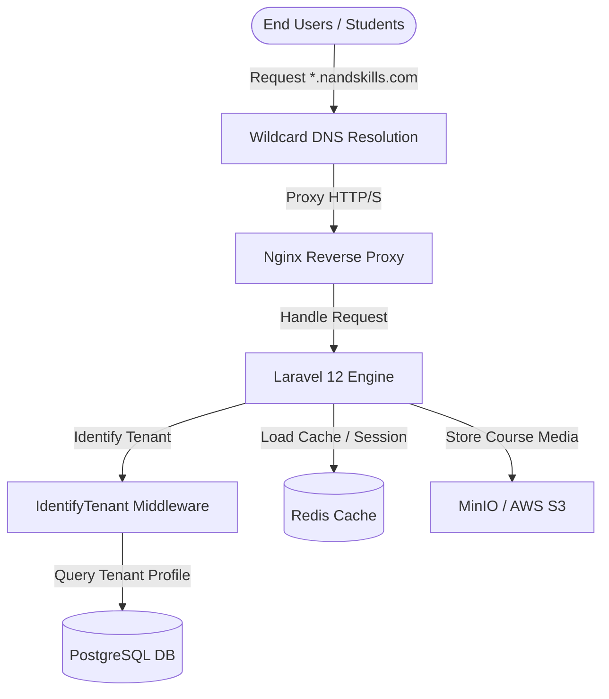

# Production Deployment Guide - NANDSKILLS Platform

This document describes the steps required to deploy the **NANDSKILLS** multi-tenant SaaS application to a production environment.

---

## 1. System Requirements & Stack
*   **Operating System**: Linux (Ubuntu 22.04 LTS or newer recommended)
*   **Web Server**: Nginx (configured for HTTP/2 and SSL)
*   **PHP Engine**: PHP 8.3 (with `fpm`, `zip`, `pdo_mysql`, `pdo_pgsql`, `redis`, `bcmath`, `mbstring`, `xml` extensions)
*   **Primary Database**: PostgreSQL 15+ (with data directory persistent storage)
*   **Cache & Queue Broker**: Redis 7+
*   **Object Storage**: MinIO or AWS S3 (for courses, media uploads, and certificates PDFs)
*   **Process Manager**: Supervisor (for managing Laravel queue workers)

---

## 2. Infrastructure Architecture & Domain Routing

The platform resolves tenants dynamically using wildcard domain mappings.



### Wildcard DNS Setup
Configure your DNS provider with a wildcard record pointing to your server's IP address:
```
A      *              1.2.3.4 (Your server IP)
A      nandskills.com 1.2.3.4
```

---

## 3. Server Configuration & Environment Setup

### Nginx Virtual Host Configuration
Create an Nginx configuration block under `/etc/nginx/sites-available/nandskills`:

```nginx
server {
    listen 80;
    listen [::]:80;
    server_name nandskills.com *.nandskills.com;
    return 301 https://$host$request_uri;
}

server {
    listen 443 ssl http2;
    listen [::]:443 ssl http2;
    server_name nandskills.com *.nandskills.com;
    root /var/www/nandskills/public;

    index index.php;

    charset utf-8;

    # SSL Certificates (Wildcard Cert via Let's Encrypt)
    ssl_certificate /etc/letsencrypt/live/nandskills.com/fullchain.pem;
    ssl_certificate_key /etc/letsencrypt/live/nandskills.com/privkey.pem;

    location / {
        try_files $uri $uri/ /index.php?$query_string;
    }

    location = /favicon.ico { access_log off; log_not_found off; }
    location = /robots.txt  { access_log off; log_not_found off; }

    error_page 404 /index.php;

    location ~ \.php$ {
        fastcgi_pass unix:/var/run/php/php8.3-fpm.sock;
        fastcgi_param SCRIPT_FILENAME $realpath_root$fastcgi_script_name;
        include fastcgi_params;
    }

    location ~ /\.(?!well-known).* {
        deny all;
    }
}
```

Enable the configuration and reload Nginx:
```bash
sudo ln -s /etc/nginx/sites-available/nandskills /etc/nginx/sites-enabled/
sudo nginx -t
sudo systemctl reload nginx
```

---

## 4. Production Environment Configuration (`.env`)

Configure your environment variables in `/var/www/nandskills/.env`:

```env
APP_NAME="NANDSKILLS"
APP_ENV=production
APP_KEY=base64:LaaLrYYnWP3+0i7tN1xEiCSC+UVwdpSrOlH5itbThqI=
APP_DEBUG=false
APP_URL=https://nandskills.com
APP_BASE_DOMAIN=nandskills.com

# PostgreSQL Configuration
DB_CONNECTION=pgsql
DB_HOST=127.0.0.1
DB_PORT=5432
DB_DATABASE=nandskills_prod_db
DB_USERNAME=nandskills_prod_admin
DB_PASSWORD=SecureProductionPassword_2026

# Cache & Session Storage
SESSION_DRIVER=redis
CACHE_STORE=redis
QUEUE_CONNECTION=redis

REDIS_CLIENT=predis
REDIS_HOST=127.0.0.1
REDIS_PASSWORD=SecureRedisPassword_2026
REDIS_PORT=6379

# Object Storage Configuration (S3 / MinIO)
FILESYSTEM_DISK=s3
AWS_ACCESS_KEY_ID=prod_s3_key
AWS_SECRET_ACCESS_KEY=prod_s3_secret_token
AWS_DEFAULT_REGION=us-east-1
AWS_BUCKET=nandskills-prod-storage
AWS_ENDPOINT=https://s3.nandskills.com
AWS_USE_PATH_STYLE_ENDPOINT=false
```

---

## 5. Deployment Commands & Optimization Pipeline

Run the following commands on the server during code updates:

```bash
# Clone/pull the repository
git pull origin main

# Install production dependencies
composer install --no-dev --optimize-autoloader

# Run database migrations (always backup database first!)
php artisan migrate --force

# Optimize Laravel cache layers
php artisan config:cache
php artisan route:cache
php artisan view:cache
php artisan event:cache

# Compile production frontend assets
npm install
npm run build
```

---

## 6. Supervisor Queue Workers

To process background jobs (email notifications, invoicing pipelines, and certificate PDF generation), set up Supervisor:

Create `/etc/supervisor/conf.d/nandskills-worker.conf`:

```ini
[program:nandskills-worker]
process_name=%(program_name)s_%(process_num)02d
command=php /var/www/nandskills/artisan queue:work redis --sleep=3 --tries=3 --max-time=3600
autostart=true
autorestart=true
stopasgroup=true
killasgroup=true
user=www-data
numprocs=4
redirect_stderr=true
stdout_logfile=/var/www/nandskills/storage/logs/worker.log
stopwaitsecs=3600
```

Start the workers:
```bash
sudo supervisorctl reread
sudo supervisorctl update
sudo supervisorctl start nandskills-worker:*
```

---

## 7. System Cron Schedule

Add the Laravel Scheduler to the system crontab to execute scheduled tasks (billing cycles, deal progression logs, and ticket SLAs):

```bash
# Open system crontab
crontab -e
```

Append the following line:
```cron
* * * * * cd /var/www/nandskills && php artisan schedule:run >> /dev/null 2>&1
```

---

## 8. Backup Policy
1.  **Database**: Schedule pg_dump daily to a separate backup volume or cold storage bucket.
2.  **User Uploads**: Ensure the S3/MinIO bucket has versioning and cross-region replication active.
